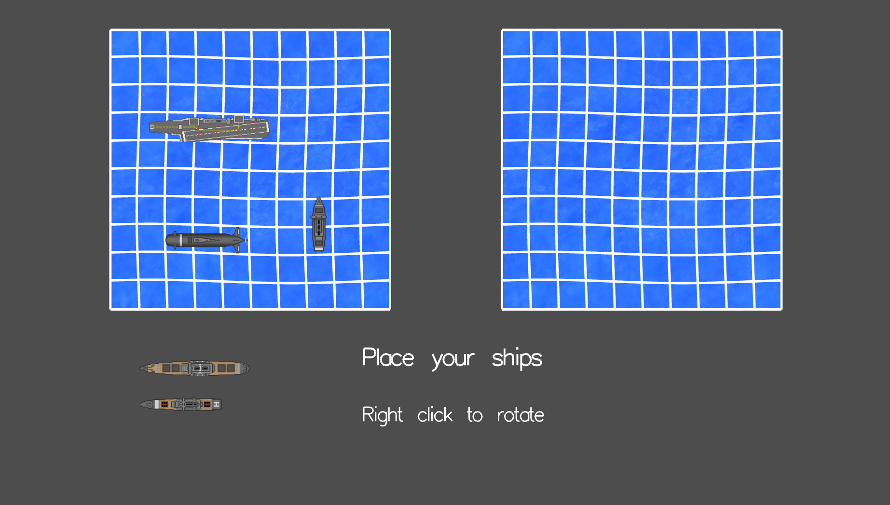
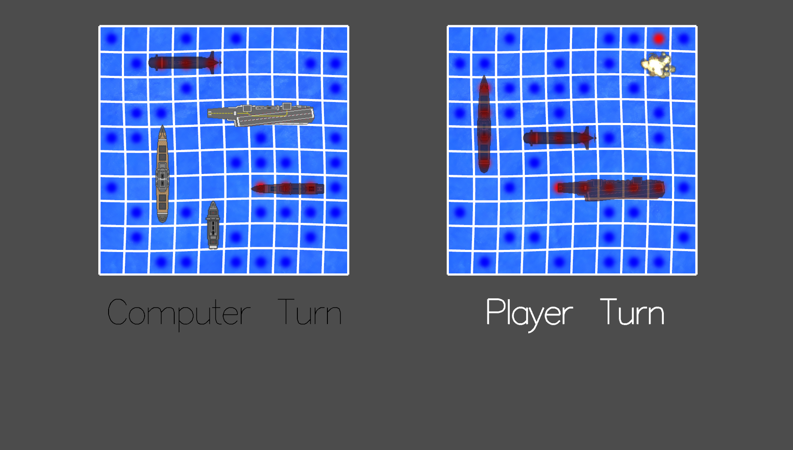

# Battleship

Battleship is a guessing game for two players. It is played on ruled grids on which the
players’ fleets of ships are marked. The locations of the fleet are concealed from the other
player. Players alternate turns to fire at the other player’s ships. The objective of the game
is to destroy the opposing player’s fleet. The game is mainly driven by mouse input. The
mouse will have different actions based on the game and the object the mouse is clicked
on. If on the title screen, left click will start the game. While placing the ships, we can use
the mouse to drag and drop the ships on to the board. While playing the game, use the
mouse to fire on a particular grid slot on the board.

